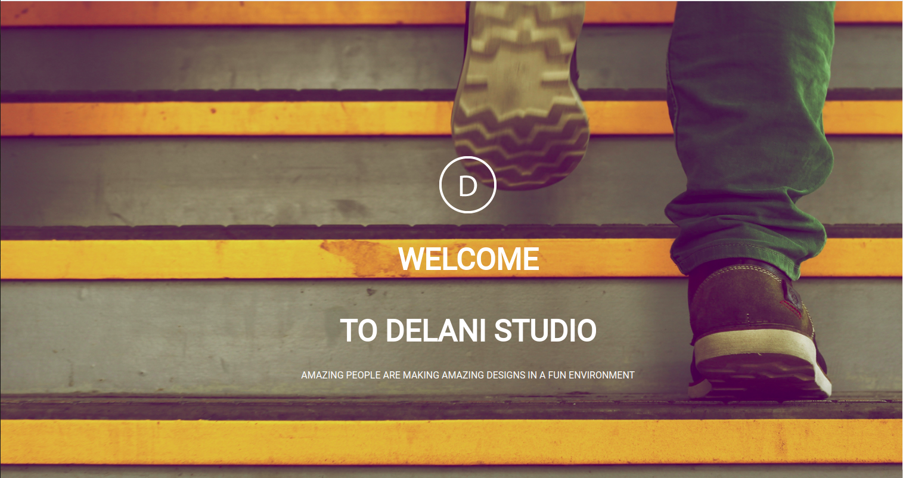

# DELANI STUDIO

#### This is a portfolio for a web design studio called Delani.
#### By https://github.com/estherndichu
## Description
This portfolio helps to show our clients the work we do and the steps we take to make their dreams into reality.
## Setup/Installation Requirements
* Open terminal on your computer.
* cd the location where you want this project.
* Follow this link to the project site : https://github.com/estherndichu/week3-ip
* Click on the code dropdown menu, click on HTTPS and copy the link that appears.
* Go back to terminal and run this command : git clone (link that you copied in step above)
* Create your own github branch and edit the code as you wish.
## BDD
* User can toggle between the icons and their descriptions.
* User is able to see image title by hovering the cursor on the image.
* User is able to interact with us via email and give their feedback.
* Click on this link to view the portfolio ; https://estherndichu.github.io/week3-ip/
## Technologies Used
This application has been built using 
* HTML
* CSS
* JavaScript
* Bootstrap
* Jquery
## Support and contact details
For any queries or further clarification on the directions to use the application, contact via email:itskuijenga@gmail.com
### License

MIT License

Copyright (c) 2021 estherndichu

Permission is hereby granted, free of charge, to any person obtaining a copy of this software and associated documentation files (the "Software"), to deal in the Software without restriction, including without limitation the rights to use, copy, modify, merge, publish, distribute, sublicense, and/or sell copies of the Software, and to permit persons to whom the Software is furnished to do so, subject to the following conditions:

The above copyright notice and this permission notice shall be included in all copies or substantial portions of the Software.

THE SOFTWARE IS PROVIDED "AS IS", WITHOUT WARRANTY OF ANY KIND, EXPRESS OR IMPLIED, INCLUDING BUT NOT LIMITED TO THE WARRANTIES OF MERCHANTABILITY, FITNESS FOR A PARTICULAR PURPOSE AND NONINFRINGEMENT. IN NO EVENT SHALL THE AUTHORS OR COPYRIGHT HOLDERS BE LIABLE FOR ANY CLAIM, DAMAGES OR OTHER LIABILITY, WHETHER IN AN ACTION OF CONTRACT, TORT OR OTHERWISE, ARISING FROM, OUT OF OR IN CONNECTION WITH THE SOFTWARE OR THE USE OR OTHER DEALINGS IN THE SOFTWARE.
  